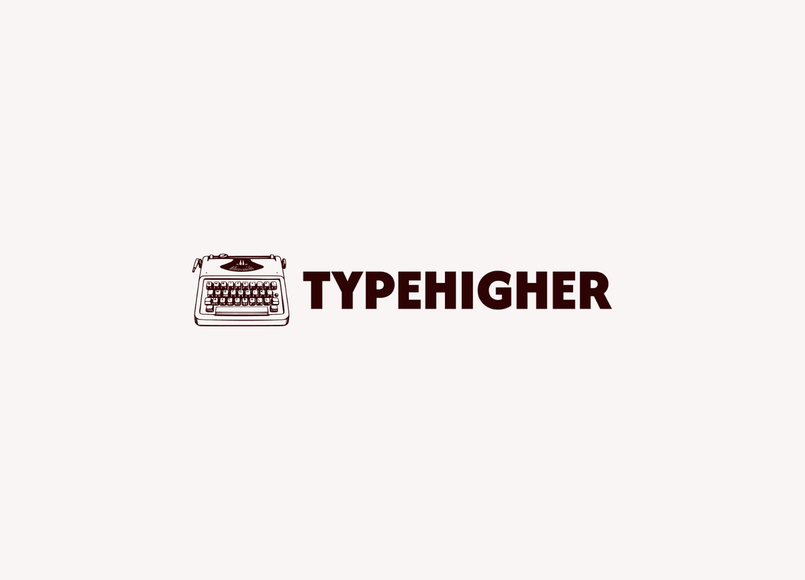
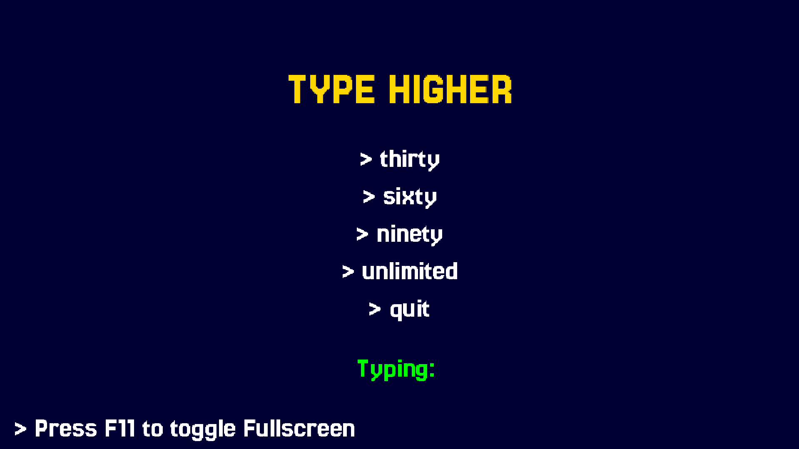

<!-- PROJECT LOGO -->
<br />
<div align="center">
  <a href="https://github.com/TingRongYou/TypeHigher.git">
    
  </a>

  <h3 align="center">TypeHigher - A 2D Typing Game</h3>
</div>

<!-- TABLE OF CONTENTS -->
<details>
  <summary>Table of Contents</summary>
  <ol>
    <li>
      <a href="#about-the-project">About The Project</a>
      <ul>
        <li><a href="#technologies-and-tools">Technologies & Tools</a></li>
      </ul>
    </li>
    <li>
      <a href="#getting-started">Getting Started</a>
      <ul>
        <li><a href="#prerequisites">Prerequisites</a></li>
        <li><a href="#installation">Installation</a></li>
        <li><a href="#architecture-note">Architecture Note</a></li>
      </ul>
    </li>
    <li><a href="#demo">Demo</a></li>
    <li><a href="#roadmap">Roadmap</a></li>
    <li><a href="#credits-and-acknowledgement">Credits & Acknowledgement</a></li>
    <li><a href="#contact">Contact</a></li>
  </ol>
</details>

## About the Project

TypeHigher is a 2D typing game built with a strict Model-View-Controller (MVC) architecture, featuring dynamic difficulty scaling and micro-step progression mechanics.

It offers:
* **Visceral Visual Feedback:** Immediate on-screen responses, featuring elastic text-scaling on correct keystrokes and aggressive red glitch/shake animations upon typos.
* **Dynamic Audio System:** Context-aware sound effects (mechanical clicks, error thuds, UI blips) and adaptive background music that smoothly transitions based on the active game state.
* **Adaptive Difficulty:** Micro-step progression mechanics that incrementally shrink time limits as the player's accuracy and speed improve.
* **Type-Driven Navigation:** Fully interactive menus (Main Menu, Pause, Game Over) that require the player to physically type their commands (e.g., > restart, > menu), keeping the core gameplay loop consistent from start to finish.

## 🛠️ Technologies & Tools

This project is built using the following core technologies:

* **[Java](https://www.java.com/):** The core programming language used for all game logic and object-oriented architecture.
* **[LibGDX](https://libgdx.com/):** A cross-platform Java game development framework used for rendering 2D graphics, managing the game loop, and handling inputs.
* **[Gradle](https://gradle.org/):** The build automation tool used to manage project dependencies (like the LWJGL3 graphics backend) and compile the application.
* **[IntelliJ IDEA](https://www.jetbrains.com/idea/):** The primary Integrated Development Environment (IDE) used for development.
* **Git:** Version control for tracking code changes and managing project history.

## ⚙️ Getting Started

Follow these steps to get the project running on your local machine.

### Prerequisites
1. Ensure you have the **Java Development Kit (JDK)** installed (JDK 8 or higher is recommended for standard LibGDX projects).
2. Ensure you have **Git** installed on your system.

### Installation
#### 1. Clone the Repository
Open your terminal or command prompt and run:
```bash
git clone [https://github.com/your-username/TypeHigher.git](https://github.com/TingRongYou/TypeHigher.git)
cd TypeHigher
```
#### 2. Open IntelliJ IDEA
1. Launch IntelliJ IDEA.
2. Click Open and select the TypeHigher root folder.
3. Wait a few moment for IntelliJ to detect the Gradle project
4. If a prompt appears asking to "Load Gradle Project" or a small Elephant icon appears in the top right, click it to sync the dependencies.

#### 3. Run the Game (Desktop)
You can launch the game directly through the terminal using the Gradle wrapper.

Open the terminal at the root of the project (or use the built-in Terminal tab at the bottom of IntelliJ) and execute the following command:

**For Windows, Mac and Linux:**
```bash
./run
```
_(Note: If you are on Windows Command Prompt, you can also type `run` without the `./`)_

**Manual Launch / Fallback:**

If the shortcut scripts do not work on your machine, you can always run the game using the standard Gradle wrapper:
* **Windows:** `gradlew lwjgl3:run`
* **Linux/Mac:** `./gradlew lwjgl3:run`

_(Note: You can also download the latest version from releases)_

### Architecture Note
This project strictly enforces the MVC (Model-View-Controller) pattern.
* Game rules, timers and string manipulation live purely in the `model` package.
* LibGDX rendering the UI live in the `view` package.
* The `controller` acts as the sole communication bridge between the two.

## 🎮 Demo

<div align="center">
  https://github.com/user-attachments/assets/9800f989-2eb3-4809-87e3-0f66b9cf6488

  <h3 align="center">TypeHigher gameplay demo</h3>
</div>

<div align="center">
  <a href="https://github.com/TingRongYou/TypeHigher.git">
    
  </a>

  <h3 align="center">TypeHigher main menu screen</h3>
</div>

## 🗺️ Roadmap
[ ] Add graphics - 2D pixels graphics
[ ] Modify scoring system
[ ] Connect to database to store results

## 📜 Credits & Acknowledgements
**Dictionary Data**

The core dictionary used to generate the typing targets in TypeHigher is sourced from the [dwyl/english-words](https://github.com/dwyl/english-words) repository.

For the purposes of this game's mechanics, the massive dataset was programmatically sanitized at runtime to exclusively use lowercase, purely alphabetic words to ensure smooth gameplay flow.

The original `dwyl` word list is free and unencumbered software released into the public domain via **The Unlicense**.

**Typography**

The game utilizes the **Jersey 25** font to achieve its retro arcade aesthetic.
* [Copyright 2023 The Soft Type Project Authors](https://github.com/scfried/soft-type-jersey)
* This Font Software is licensed under the **SIL Open Font License, Version 1.1**. A copy of the license is included in the repository.

**Audio (BGM & SFX)**

All background music and sound effects used in this game are royalty-free assets sourced from [Pixabay](https://pixabay.com/).

They are utilized under the Pixabay Content License, which allows for free commercial and non-commercial use without requiring individual author attribution.

## 🧑‍💻 Contact
**Ting Rong You**
* **email:** [ryting999@gmail.com](ryting999@gmail.com)
* **LinkedIn:** [Connect with me here](https://linkedin.com/in/ting-rong-you-945aab3b6)
